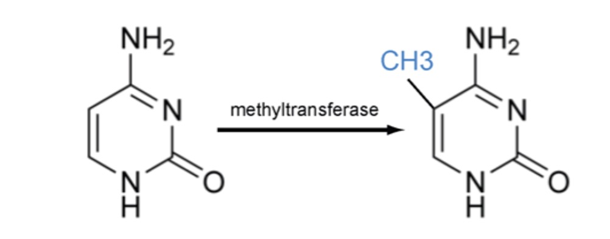
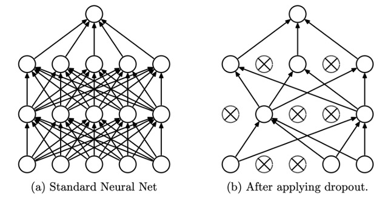
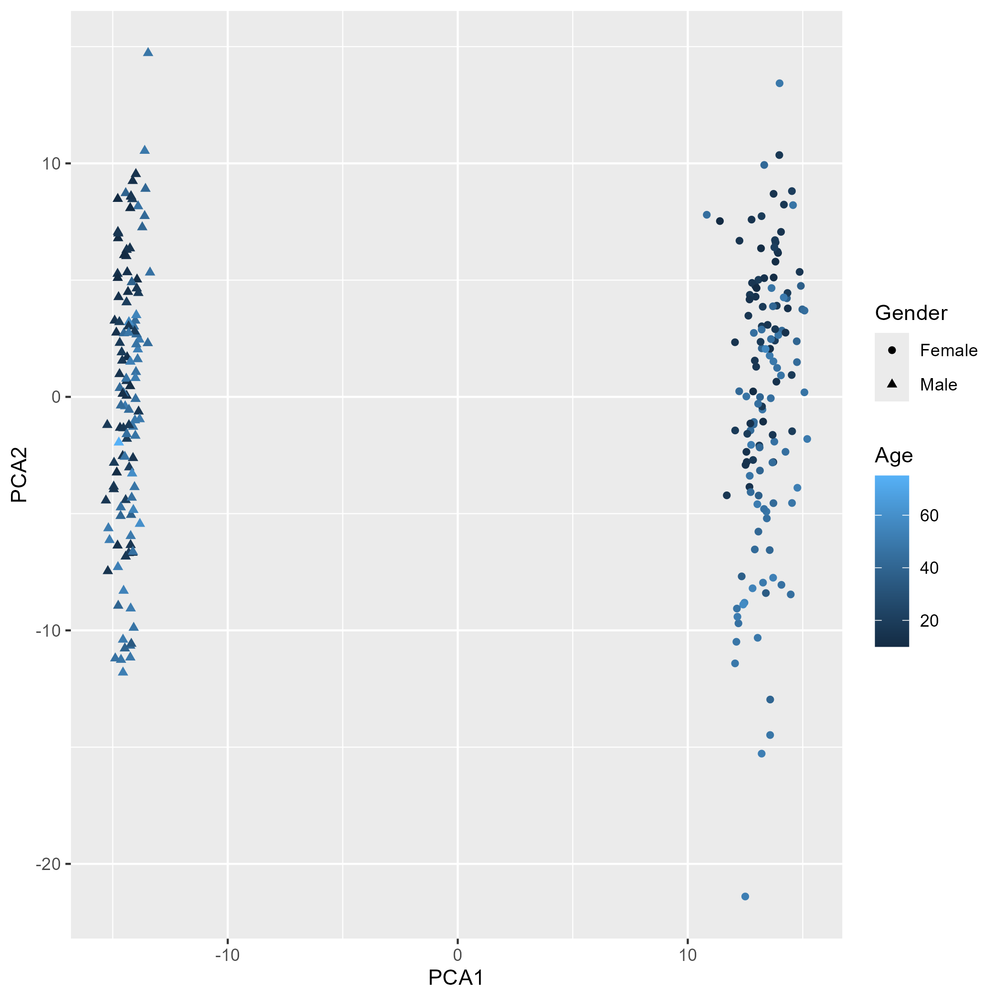
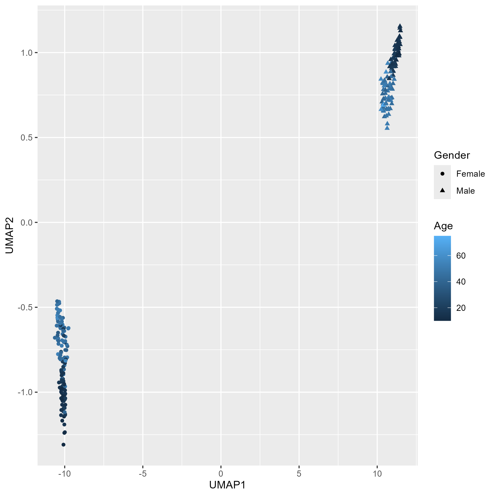
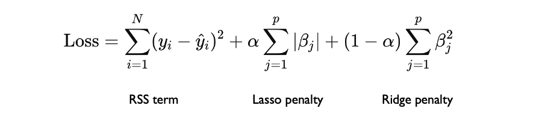

# Predicting Age with DNA Methylation data
I completed this analysis in my final semester at Curtin University as part of the "Industrial Project" (MATH3004) unit to complete my Bachelor of Science (Data Science) degree.
## Overview

Analysis of different age prediction models using methylation levels present in human DNA. An elastic-net regression is created from the dataset. A neural network is trained using the first 60 principle components of Principle Component Analysis on the dataset. A second neural network is trained using the first 16 components of Uniform Manifold Approximation (UMAP) on the dataset. 

## Methylation 
DNA methylation is an epigenetic process used by the body to influence gene expression and cellular function without changing the structure or sequence of the DNA. Methylation usually occurs when a methyl group attaches to cytosine in DNA (Moore, Le, and Fan 2012). Methylation is commonly measured using an Illumina 450k array which includes a methylation level between 0 and 1 for 450 000 methylation sites around the body. Changes in DNA methylation can occur due to several external factors including age, diet and lifestyle (Kader, Ghai, and Maharaj 2018).

## Project Objective

The objective of this research is to create an epigenetic clock model to predict chronological age from a person’s DNA methylation profile. Elastic-net regression and neural networks will be used to model age, and the performance of both models compared.

This project provides insight into the relative prediction accuracy of elastic-net and neural networks on age estimation when applied to high-dimensional datasets. While there is research available that applies these methods singularly, there isn't extensive research on their comparative predictive abilities when applied to the same data. The best neural network will be compared against the best elastic net regression to compare the two methods. The two neural networks are compared to check the dimensionality reduction capabilities of PCA and UMAP. 

## Dataset 

The data set used contains Illumina 450k DNA methylation array data. The dataset is from the Powell et al. (2012) study which studied the epigenetics of families and the heritable similarity between family member’s epigenetics. The data includes 257 samples of 450 000 variables from people between the ages of 10 and 75. The data is not independent as it includes the epigenetic profiles of families which may share heritable epigenetic traits. Due to the larg esize of the dataset 1.27Gb it is not provided in the repository 

## Data Cleaning and Preprocessing 

The data set provided from the Powell et al. (2012) study is pre-processed to avoid bias and error from the array collection method. The pre-processing included the “removal of background chip effect, removal of outliers, computation of average bead signal and calculation of detection p-values using negative controls presented on the array” Powell et al. (2012).

The dataset contained 0.24% missing values which were imputed based on gender as Hannum et. al (2013) showed that the gender of a person effects their methylation profile. 
## Tools Used 
* **R Studio**: Data prep and cleaning, PCA reduction, UMAP reduction, Elastic-Net regression and visualisation
* **Python**: Tensorflow neural networks, visualisations 

## Optimisations 
**Data structure**: When the BDGMethylation.csv file provided is transposed to the correct orientation it increased in size from 1.27Gb to 8GB due to the extremely feature number which is not ordinary or optimised for in most software. I transformed the data from a 'Data Frame' to a 'Numeric matrix' which reduced the data size from 8Gb to 1Gb. The 'Numeric matrix' data structure optimised the data structure making reading and writing the dataframe which more efficient and less time consuming. 

**Min-Max Scaling**: Scaling was applied to the data as neural networks trained with features of the same scale have improved gradient descent in the training of a neural network resulting in a faster convergence (Al-Faiz et al. 2018).

**Drop-Out Regularisation**: The dropout regularization technique is used in the training of the neural networks to prevent overfitting. As shown in figure 2 dropout technique randomly removes a percentage of nodes from each hidden layer before each epoch in the training of the network. The removed nodes parameter values are not updated for the specific epochs in which they are removed. The random removal of the nodes prevents the model from overfitting to the data and prevents the model relying mostly on specific nodes in the network for its predictions. The model trained with dropout regularization has better generalised predictive abilities (Gal et al. 2016)

## Principal Component Analysis 

Principal component analysis is first applied producing 255 principal components. The PCA plot of the first two components below displayed a significant male outlier that had a PCA 2 component of over 30 which was significantly larger than the remaining samples therefore it is concluded it is an outlier and removed. The PCA plot showed significant seperation of gender in the PCA 1 component and slight age seperation in the PCA 2 component. 

## UMAP 

The UMAP transformation is computationally expensive therefore 16 features were the maximum number of features it could produce. Through experimentation and testing a value of 20 neighbours was found to give the best results allowing both global and local features to be preserved in the reduced data. The optimal minimum distance was found to be 0.1. The resulting lower-dimensional dataset showed significant separation between gender and some separation of different ages as shown below. 

## Neural Networks 

### UMAP Neural Network

### PCA Neural Network

## Elastic-net regression 
Elastic net regression is a linear hybrid regression technique which uses the Lasso penalty and Ridge penalty to fit data to a linear model with the lowest Residual Sum of Squares (RSS). The Lasso and Ridge penalties are used to prevent overfitting with each penalty having a specific purpose. The elastic-net regression combines the benefits of Lasso and Ridge regression allowing the model to both shrink and remove parameters. An elastic-net regression is therefore suitable for the high-dimensional methylation data set as it can shrink or remove variables allowing for correlated or unimportant variables to be removed. The loss function used by the elastic-net regression is shown below. 

The elastic-net regression model is using the ‘glmnet’ package in R studio. The ‘cv.glmnet’ function uses 10 fold cross validation to train, test and optimise the model parameters while using only the training data. The optimal model achieved a standard error of 2.605 years and an R squared coefficient of 0.975. It used 102 different methylation sites to predict age. The predictions and real age values are visually presented below. The model was very accurate at predicting young people between the ages 10 to 20, however it was marginally less accurate at predicting older people between ages 35 to 60.

## Findings 
## Conclusions 
## Acknowledgements
* Powell JE, Henders AK, McRae AF, Caracella A, Smith S, Wright MJ, et al. (2012) The Brisbane Systems Genetics Study: Genetical Genomics Meets Complex Trait Genetics. PLoS ONE 7(4): e35430. https://doi.org/10.1371/journal.pone.0035430 (Data Source)

* Hannum, Gregory, Justin Guinney, Ling Zhao, Li Zhang, Guy Hughes, SriniVas Sadda, Brandy Klotzle, et al. 2013. “Genome-Wide Methylation Profiles Reveal Quantitative Views of Human Aging Rates.” Molecular Cell 49 (2): 359–67. https://doi.org/10.1016/j.molcel.2012.10.016. (Affect of gender on Methylation profiles)

* Al-Faiz, Mohammed Z, Ali Abdulhafidh Ibrahim, and Sarmad M Hadi. 2019. “The Effect of Z- Score Standardization (Normalization) on Binary Input Due the Speed of Learning in Back- Propagation Neural Network.” Iraqi Journal of Information and Communication Technology 1 (3): 42–48. https://doi.org/10.31987/ijict.1.3.41.